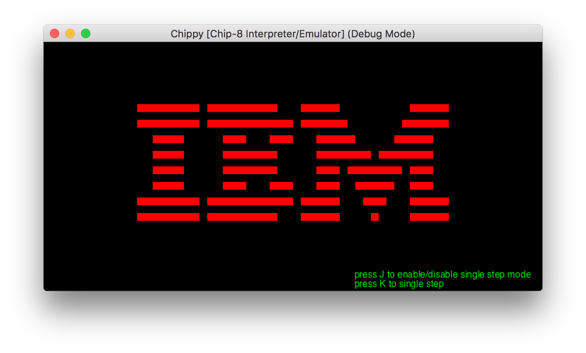
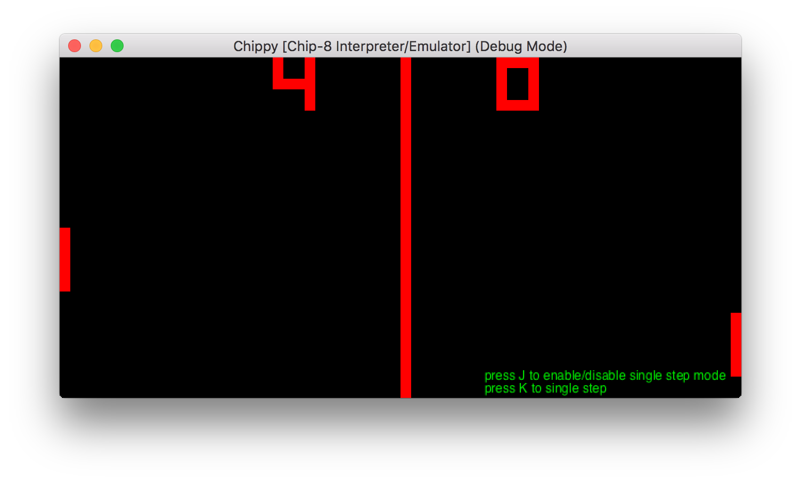
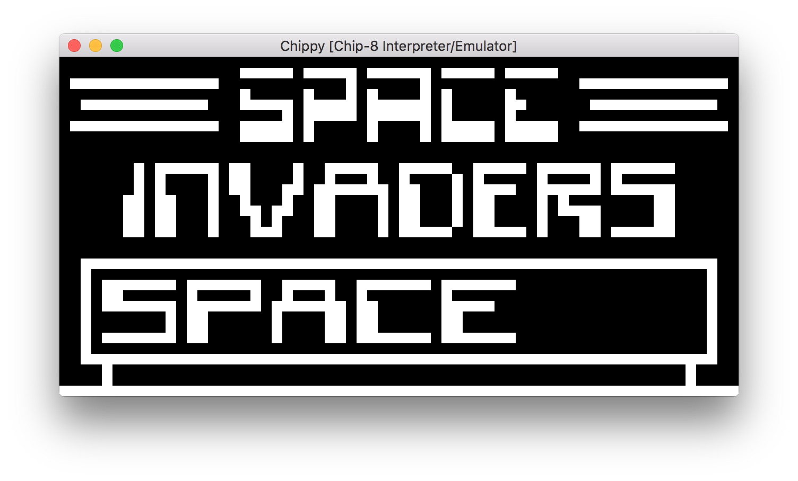

# chippy
A Chip-8 Interpreter/Emulator in C++. 

- Uses the Cinder Framework v0.9.0 (https://libcinder.org/) for graphics and audio.
- Debug mode build switch allows halting the program and allows single-stepping through the program. 
- Includes some sample programs. Drag .ch8 file ontop of the program window to run.

Keyboard mapping:
  - 1	2	3	C  | 1 2 3 4
  - 4	5	6	D  | Q W E R
  - 7	8	9	E  | A S D F
  - A	0	B	F  | Z X C V

Known issues:
- framerate slow down after some time. currently investigating this.
- haven't tested all programs. seen some programs to contain invalid opcodes.

Chippy in action:

